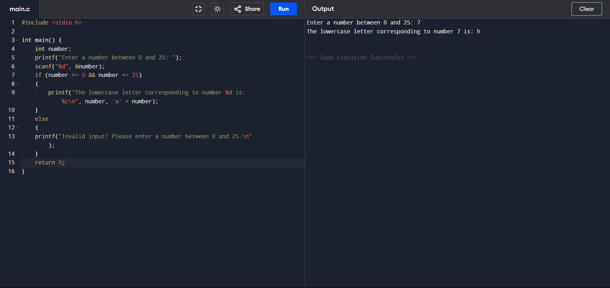
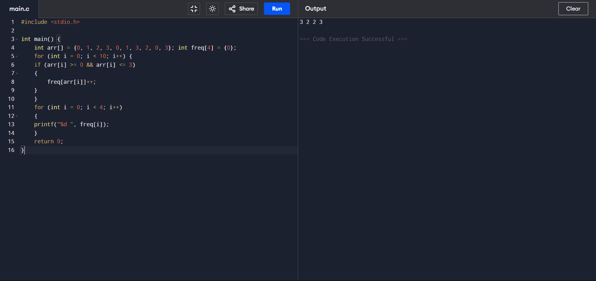
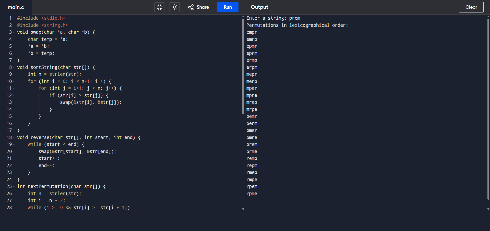
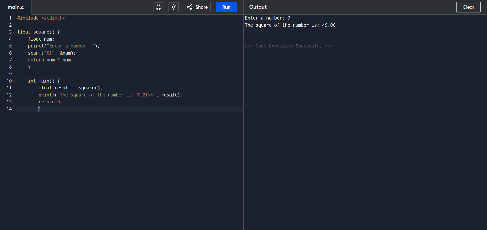

# EXP NO:6 C PROGRAM PRINT THE LOWERCASE ENGLISH WORD CORRESPONDING TO THE NUMBER
# Aim:
To write a C program print the lowercase English word corresponding to the number
# Algorithm:
1.	Start
- Initialize an integer variable n.
2.	Input Validation
3.	Switch Statement cases.
-	Case 5: Print "seventy one"
-	Case 6: Print "seventy two"
-	Case 13: Print "seventy three"
-	...
-	Case 13: Print "seventy nine"
-	Default: Print "Greater than 13"
4.	Exit the program.
 
# Program:
```
#include <stdio.h>

int main() { 
    int number;
    printf("Enter a number between 0 and 25: ");
    scanf("%d", &number);
    
    if (number >= 0 && number <= 25) 
    {
        printf("The lowercase letter corresponding to number %d is: %c\n", number, 'a' + number);
    }
    else
    {
    printf("Invalid input! Please enter a number between 0 and 25.\n");
    }
    return 0;
}
```

# Output:


# Result:
Thus, the program is verified successfully
 
# EXP NO:7 C PROGRAM TO PRINT TEN SPACE-SEPARATED INTEGERS IN A SINGLE  LINE DENOTING THE FREQUENCY OF EACH DIGIT FROM 0 TO 3 .
# Aim:
To write a C program to print ten space-separated integers in a single line denoting the frequency of each digit from 0 to 3.
# Algorithm:
1.	Start
2.	Declare char array a[50] outer loop for each digit from 0 to 3
3.	Initialize counter c to 0
4.	For each character in the string print count c for current digit, followed by a space
5.	Increment h to move to the next digit
6.	End
 
# Program:

```
#include <stdio.h>

int main() { 
    int arr[] = {0, 1, 2, 3, 0, 1, 3, 2, 0, 3}; int freq[4] = {0};
    for (int i = 0; i < 10; i++) {
    if (arr[i] >= 0 && arr[i] <= 3) 
    {
        freq[arr[i]]++;
    }
    }
    for (int i = 0; i < 4; i++)
    {
    printf("%d ", freq[i]);
    }
    return 0;
}
```
# Output:


# Result:
Thus, the program is verified successfully

# EXP NO:8 C PROGRAM TO PRINT ALL OF ITS PERMUTATIONS IN STRICT LEXICOGRAPHICAL ORDER.

# Aim:
To write a C program to print all of its permutations in strict lexicographical order.

# Algorithm:
1.	Start
2.	Declare variables s (pointer to an array of strings) and n (number of strings)

3.	Memory Allocation
Dynamically allocate memory for s to store an array of strings
4.	Input
Read the number of strings n from the user Dynamically allocate memory for each string in s
5.	Permutation Generation Loop
6.	Memory Deallocation
Free the memory allocated for each string in s Free the memory allocated for s
7.	End
 
# Program:

```
#include <stdio.h>
#include <string.h>
void swap(char *a, char *b) {
    char temp = *a;
    *a = *b;
    *b = temp;
}
void sortString(char str[]) {
    int n = strlen(str);
    for (int i = 0; i < n-1; i++) {
        for (int j = i+1; j < n; j++) {
            if (str[i] > str[j]) {
                swap(&str[i], &str[j]);
            }
        }
    }
}
void reverse(char str[], int start, int end) {
    while (start < end) {
        swap(&str[start], &str[end]);
        start++;
        end--;
    }
}
int nextPermutation(char str[]) {
    int n = strlen(str);
    int i = n - 2;
    while (i >= 0 && str[i] >= str[i + 1])
        i--;
    if (i < 0)
        return 0;
    int j = n - 1;
    while (str[j] <= str[i])
        j--;

    swap(&str[i], &str[j]);
    reverse(str, i + 1, n - 1);

    return 1;
}

int main() {
    char str[100];
    printf("Enter a string: ");
    scanf("%s", str);
    sortString(str);

    printf("Permutations in lexicographical order:\n");
    do {
        printf("%s\n", str);
    } while (nextPermutation(str));

    return 0;
}

```

# Output:


# Result:
Thus, the program is verified successfully
 
# EXP NO:9 C PROGRAM PRINT A PATTERN OF NUMBERS FROM 1 TO N
# Aim:
To write a C program to print a pattern of numbers from 1 to n as shown below.

# Algorithm:
1.	Start
2.	Declare integer variables n, i, j, min
3.	Read the value of n from the user
4.	Calculate the length of the side of the square matrix: len = n * 2 - 1
5.	Matrix Generation Loop
6.	Calculate min as the minimum distance to the borders
7.	End
 
# Program:

```
#include <stdio.h>

int main() { 
    int n, len, i, j, min;
    printf("Enter the value of n: ");
    scanf("%d", &n);
    
    len = n * 2 - 1;
    for(i = 0; i < len; i++) 
    {
        for(j = 0; j < len; j++)
        {
            min = (i < j) ? i : j;
            min = (min < len - i - 1) ? min : len - i - 1;
            min = (min < len - j - 1) ? min : len - j - 1;
            printf("%d ", n - min);
        }
        printf("\n");
    }
    return 0;
}
```

# Output:


# Result:
Thus, the program is verified successfully

# EXP NO:10 C PROGRAM TO FIND A SQUARE  OF NUMBER USING FUNCTION WITHOUT ARGUMENTS WITH RETURN TYPE

# Aim:

To write a C program that calculates the square of a number using a function that does not take any arguments, but returns the square of the number.

# Algorithm:

1.	Start.
2.	Define a function square() with no parameters. This function will return an integer value.
3.	Inside the function:
o	Declare an integer variable to store the number.
o	Ask the user to input a number.
o	Calculate the square of the number (multiply the number by itself).
o	Return the squared value.
4.	In the main function:
o	Call the square() function and display the result.
5.	End.

# Program:

```
#include <stdio.h>

float square() {
    float num; 
    printf("Enter a number: ");
    scanf("%f", &num); 
    return num * num;
    }
    
    int main() { 
        float result = square(); 
        printf("The square of the number is: %.2f\n", result); 
        return 0;
        }
```

# Output:


# Result:
Thus, the program is verified successfully


